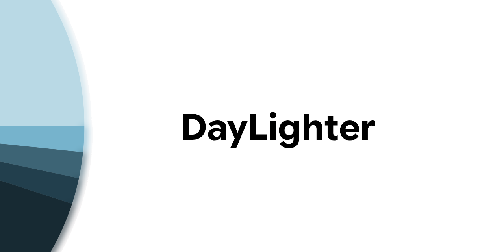
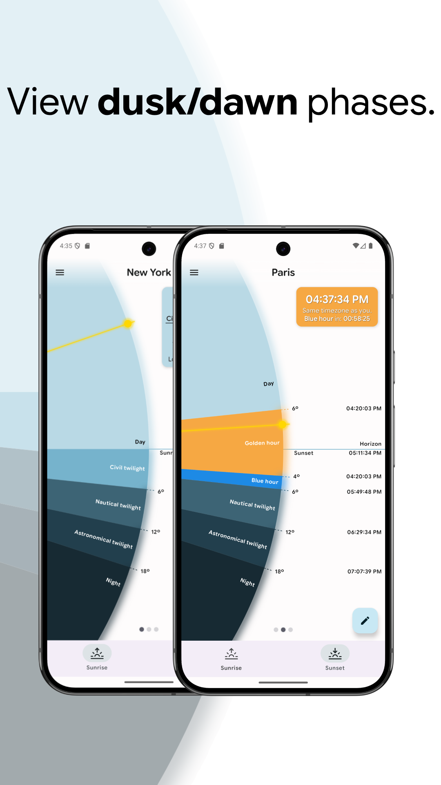
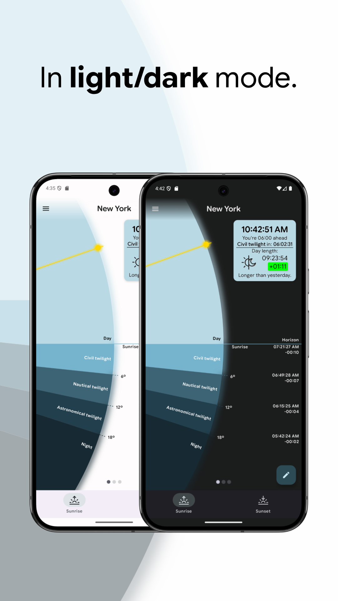
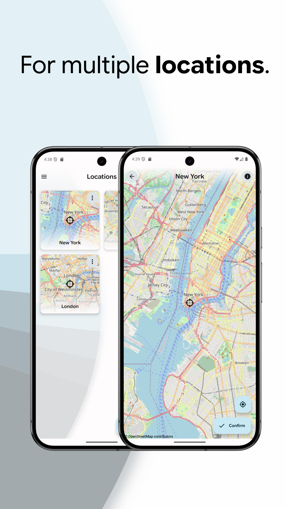
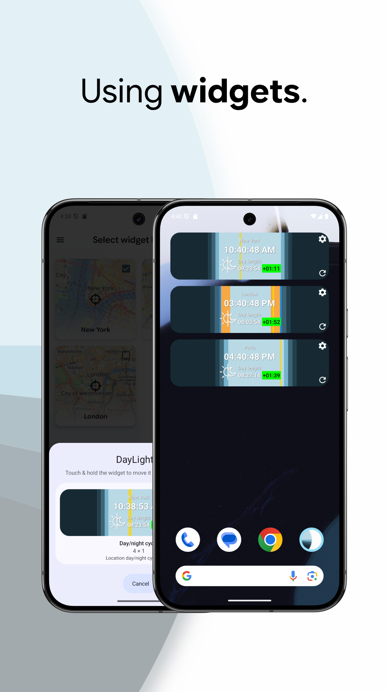
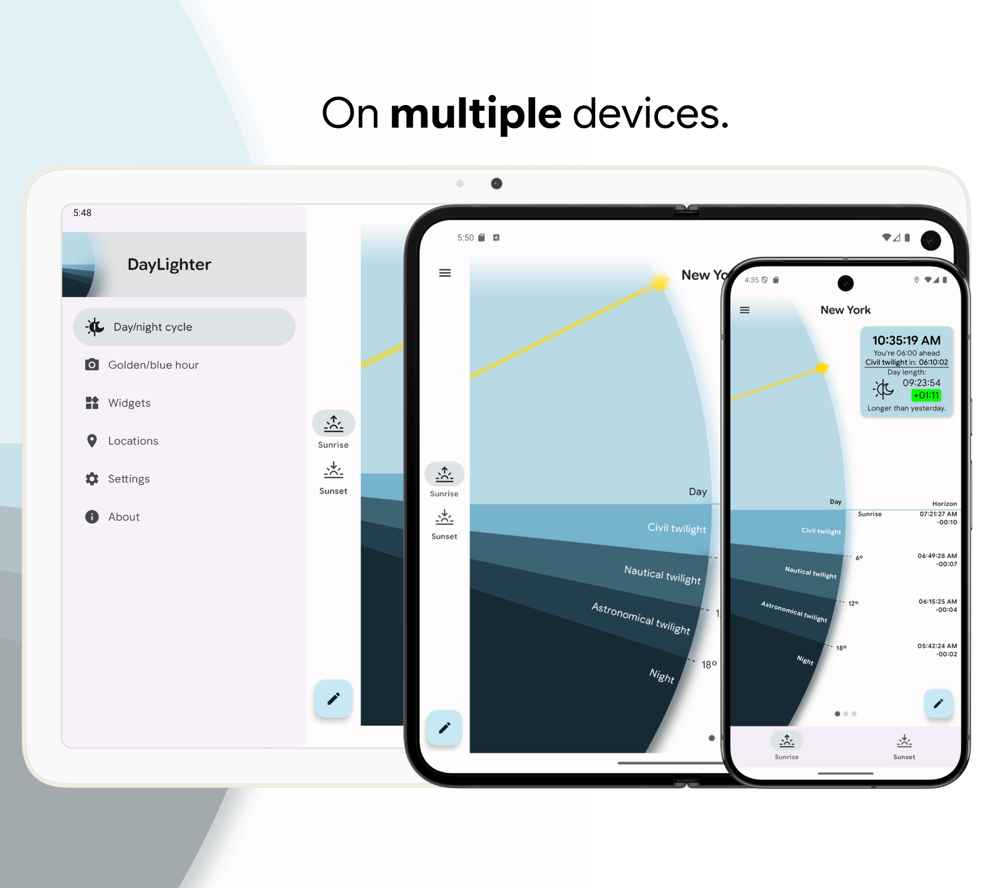

  

## About

<b><i>DayLighter</i></b> is a Material 3 themed android app for tracking <b>dusk/dawn phases</b> as well as <b>golden/blue hours</b>.

## Screenshots

### Features

- Dusk/dawn phases <b>chart</b>
- <b>Location customization</b> with geocoding support
- Automatically updated <b>home screen widgets</b>

## Used technologies

- [Jetpack Navigation (aka "Navigation 2")](https://developer.android.com/jetpack/androidx/releases/navigation) - screen flows definition, backstack management 
- [Room](https://developer.android.com/jetpack/androidx/releases/room) - database for on-device location storage
- [Datastore](https://developer.android.com/jetpack/androidx/releases/datastore) - user preference storage
- [Hilt](https://dagger.dev/hilt/) - dependency injection
- [Retrofit](https://square.github.io/retrofit/) - network requests
- [Coroutines](https://kotlinlang.org/docs/coroutines-guide.html) - asynchronous/concurrent programming
- [Glance](https://developer.android.com/develop/ui/compose/glance) - compose-based home screen widgets
- [WorkManager](https://developer.android.com/jetpack/androidx/releases/work) - periodic widget updates
- [Osmdroid](https://github.com/osmdroid/osmdroid) - maps
